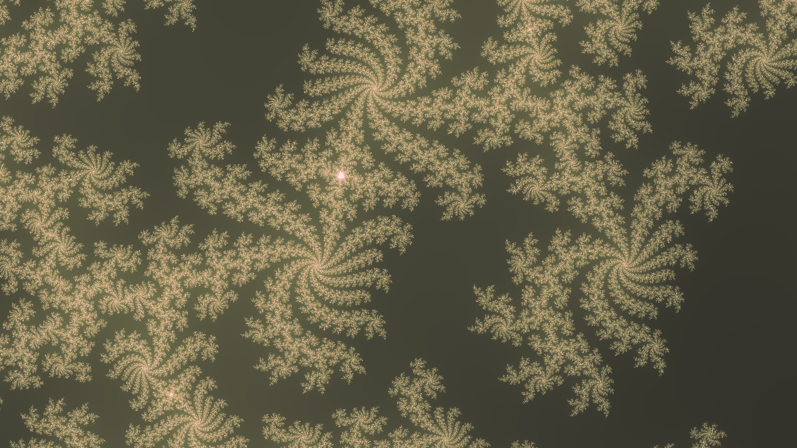

# Mbrot
Simple to use CLI mandelbrot fractal generator.
Generates a random and configurable mandelbrot fractal (png) image.

# Demos



# Running
Download a release from [here](https://github.com/Logan-010/mbrot/releases/latest)

Open your terminal emulator of choice and run the following to bring up the help menu
```sh
mbrot -h
```

Or just run `mbrot` with no arguments to generate a random mandelbrot fractal and save it to `out.png`

# Building
Be sure to have the git and rust toolchain installed (cargo, rustc, etc).

Clone the repository and build the project (may take a while to build).
```
git clone https://github.com/Logan-010/mbrot
cd mbrot
cargo build --release
```

The executable will be under target/release/mbrot.

# Credits
Inspired by [this](https://github.com/heitzmann/mandelbrot) repo

Built with:
- Rust
- Clap
- Image (rust library)
- Rayon
- Fastrand